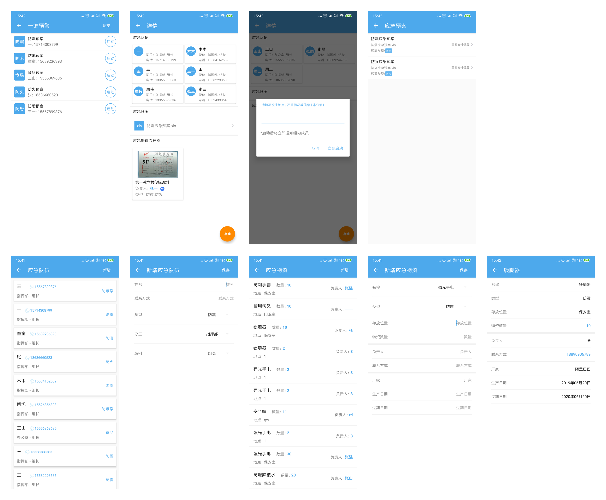

#项目结构
    |-- area                                区领导相关
    
        |-- assess
            |-- AreaAssessControl.java							风险评估Control层，网络数据请求
            |-- AssessAdapter.java									已完成/草稿 列表适配器
            |-- AssessAddActivity.java							新增Activity[TabLayout：评估一级数据源]
            |-- AssessAddFragment.java							新增Fragment[根据一级数据源获取二级&三级数据源]
            |-- AssessAPI.java											风险评估相关网络接口
            |-- AssessBaseActivity.java							初始化Dialog数据
            |-- AssessDescribeActivity.java					风险评估已完成风险项详情
            |-- AssessDetailActivity.java						风险评估已完成详情[Tablayout-风险等级]
            |-- AssessDetailAdapter.java						风险评估已完成详情-风险项适配器
            |-- AssessDetailFragment.java						风险评估已完成详情Fragment[风险等级对应的风险项列表]
            |-- AssessFirstAdapter.java							风险评估二级列表展开
            |-- AssessMainActivity.java							风险评估 Main Activity 「已完成列表」
            |-- AssessOperationAdapter.java					风险评估 确认风险项 适配器
            |-- AssessOperationListActivity.java		风险评估 确认风险项 Activity
            |-- AssessRecyclerActivity.java					风险评估 草稿列表
            |-- AssessSecondAdapter.java						风险评估 评估 Item 适配器
            |-- AssessStringAdapter.java						风险评估 单个String适配器
            |-- AssessTargetAndLevelActivity.java 	风险级别 & 选择学校
            
        |-- event
        		|-- AreaEventActivity.java							安全事件 Main Activity
        		|-- AreaEventAdapter.java								安全事件 「未归档 & 已归档」列表适配器
        		|-- AreaEventAddActivity.java						新增 & 上报 事件
        		|-- AreaEventAPI.java										安全事件 网络接口
        		|-- AreaEventControl.java								安全事件Control
        		|-- AreaEventDDealActivity.java					安全事件 详情页 「批复 & 上报」
        		|-- AreaEventDetailFragment.java				安全事件 基本信息
        		|-- AreaEventDInProgressActivity.java		安全事件 详情页 「追加 & 撤回」查看事件进度
        		|-- AreaEventDPlaceActivity.java				安全事件 归档详情
        		|-- AreaEventDSumActivity.java					安全事件 详情页 「复议 & 归档」去归档
        		|-- AreaEventFlowAdapter.java						安全事件 事件流 适配器
        		|-- AreaEventFragment.java							安全事件 Main Fragment
        		|-- AreaEventInitManagement.java				添加 & 修改 控制器
        		|-- AreaEventNewDetailActivity.java			安全事件 详情页 草稿
        		|-- AreaEventPostManagement.java				事件上传管理类
        		|-- ArealCallback.java									
        		|-- DialogListAdapter.java							安全事件 「事件等级 & 事件地点 & 事件类型」适配器
        		|-- DownloadFileUtil.java								文件 & 音频 下载工具
        		|-- DownloadListener.java								下载监听器
        		|-- EventAddWorkPeopleDialog.java
        		|-- EventWorkDeleteDialog.java					安全事件 删除办事人员
        		|-- EventWorkPeopleAdapter.java					安全事件 办事人员 适配器
        		|-- OnVoiceFinishListener.java					音频播放 监听器
        		|-- VideoAdapter.java										视频 适配器
        		|-- VoiceAdapter.java										音频适配器
        		|-- VoiceService.java										Service中播放音频文件
        		|-- VService.java												音频播放监听器
        		
        |-- securityfile														安全文件
        		|-- AreaFileAdapter.java								安全文件 & 安全通知 列表适配器
        		|-- AreaFileDetailActivity.java					安全文件详情
        		|-- AreaFileFragment.java								安全文件 Main Fragment
        		|-- AreaFileIssuedActivity.java					安全文件下发Activity
        		|-- AreaFileRefreshBroadCast.java				安全文件 广播「签收&下发成功后刷新界面」
        		|-- AreaFileReminderSignActivity.java		安全文件催签记录
        		|-- AreaFileSignAdapter.java						安全文件 签收 & 催签 Item Adapter
        		|-- SecurityFileActivity.java						安全文件 Main Activity		
        		|-- SecurityFileAPI.java								安全文件 相关接口
        		|-- SecurityFileControl.java						安全文件网络接口管理
        		|-- SecurityFileListActivity.java				安全文件 列表界面
        		
        |-- securitynotify													安全通知
        		|-- AreaNotifyActivity.java							安全通知 Main Activity
        		|-- AreaNotifyAddActivity.java					安全通知 新增
        		|-- AreaNotifyDetailActivity.java				安全通知 详情
        		|-- AreaNotifyFragment.java							安全通知 Main Fragment
        		|-- AreaNotifySignAdapter.java					安全通知 Adapter
        		|-- AreaPressCountActivity.java					安全通知 催看
        		|-- AreaSignActivity.java								安全通知 通知查看详情
        		|-- SecurityNotifyAPI.java							安全通知 网络接口
        |-- AreaServer.java													
        |-- StringAdapter.java
        
    |-- base————基础类
        |-- BaseActivity.java												渲染省市区校领导首页数据
        |-- BaseControl.java												首页数据Control
        |-- BaseResponse.java												后台返回的数据模基础类
        |-- BaseSubscriber.java											Rxjava订阅者封装
        |-- ExceptionHandle.java										网络异常处理类
        |-- RetrofitClient.java											网络请求封装类
        
    |-- city
        |-- CityMainActivity.java										市级用户首页
        
    |-- database————「项目中没有用到本地数据库」
        |-- DbOpenHelper.java
        |-- NotifyDAO.java
        
    |-- homepage————省市区校领导首页样式配置	
    		|-- AQWJAxisValueFormatter.java					图表 安全文件 横坐标
        |-- HomeActivity.java										区领导首页
        |-- HomeAPI.java												首页网络接口
        |-- HomeAqsjFragment.java								首页 图表 安全事件
        |-- HomeAqwjFragment.java								首页 图表 安全文件
        |-- HomeGgtjFragment.java								首页 图表 通知公告
        |-- HomeGridAdapter.java								首页 功能图表 Adapter
        |-- HomeGridMenuFragment.java						首页 各个角色的功能模块配置
        |-- HomeSelectDateActivity.java					首页 时间选择
        |-- HomeSelectTypeActivity.java					首页 学校/区域 选择
        |-- HomeXJFragment.java									首页 图表 巡检
        |-- HomeYHFragment.java									首页 图表 隐患
        |-- MainActUtils.java										首页 右上角通知动画
        |-- YHMonthValueFormatter.java					首页 图表 隐患 横坐标
        
    |-- jpush————极光推送相关「来自极光推送Demo」
    		|-- ExampleUtil.java	
    		|-- JPushReceiver.java									自定义接收器
        |-- JPushUtil.java
        |-- Logger.java
        |-- MyJPushMessageReceiver.java
        |-- ResponseNoticeMessage.java					后台返回的自定义消息体
        |-- TagAliasOperatorHelper.java
        
    |-- login————登录／引导页相关
    		|-- LoginActivity.java									登录
    		|-- LoginServer.java					
    		|-- SplashActivity.java									闪屏页
    		|-- UpdateActivity.java									发现新版本 & 更新「DiscussDialog」
    		|-- UpdateHelper.java										版本更新辅助类
    		|-- UpdateMarketAdapter.java						应用市场Adapter
    		|-- WelcomeActivity.java								欢迎页
    		
    |-- model————数据模型
    
    |-- organize————组织架构
    		|-- OrganizeServer.java									项目中涉及到选择市区部门和人的
    		|-- SelectOrganizeActivity.java					组织架构 Main Activity
    		|-- SelectOrganizeAdapter.java					Content Item Adapter
    		|-- SelectOrganizeFragment.java					组织架构上下级切换
    		|-- SelectOrganizeNumberAdapter.java		组织架构 成员 Item Adapter
    		|-- SelectOrganizePicker.java						组织架构数据源设置类
    		|-- SelectOrganizeTabMenuAdapter.java		组织架构导航
    		
    |-- personal————个人资料相关
    		|-- AboutUsActivity.java								关于我们
    		|-- PersonalInfoActivity.java						个人信息
    		|-- SetJPushReceiverTimeActivity.java		极光推送接收时间设置
    		|-- SettingActivity.java								设置
    		|-- SpaceActivity.java									项目空间
    		|-- SpaceManageActivity.java						项目空间
    		|-- StorageUtils.java										获取存储介质
    		|-- SuggestionActivity.java							建议
    		|-- UpdateBroadcastReceiver.java				更新APP
    		
    |-- photo————图片选择／展示文件相关
    		|-- CornersTransform.java							圆角 Transform		
    		|-- OpenFileHelper.java								文件预览辅助类
    		|-- PatActivity.java									随手拍
    		|-- PhotoAdapter.java									图片选择器 Adapter
    		|-- PhotoAPI.java											文件上传网络接口
    		|-- PhotoUtils.java										数据转化「List->List<MultipartBody.Part>等」				
    		|-- RecyclerItemClickListener.java		图片选择器 点击事件
    		|-- ShowFileActivity.java							文件预览
    		
    |-- province————省用户角色
    		|-- count「假数据，待产品经理设计」
    				|-- CountAdapter.java					
    				|-- ProvinceCountActivity.java
    		|-- ProvinceMainActivity.java						省用户角色 Main Activity
    		
    |-- school————校领导相关
    		|-- count「假数据，待产品经理设计」
    				|-- AgeAxisValueFormatter.java				外来人员 年龄分布柱状图		
    				|-- ChartJfdjFragment.java						纠纷图表统计
    				|-- ChartKqFragment.java							考勤图表统计
    				|-- ChartWlryFragment									外来人员图表统计
    				|-- ChartXjFragment.java							巡检图表统计					
    				|-- ChartYHFragment.java							隐患图表统计
    				|-- ChartYLFragment.java							演练统计
    				|-- SchoolCountActivity.java					数据统计
    				|-- SchoolCountAdapter.java
    				|-- SchoolCountFragment.java					
    				|-- XJAxisValueFormatter.java					巡检横坐标
    				|-- YHCountActivity.java							隐患统计
    				|-- YLAxisValueFormatter.java					演练横坐标
    		|-- yihuan
    				|-- task————任务&检查
    						|-- CheckAdapter.java							检查 列表 Adapter
    						|-- CheckBHGActivity.java					检查 不合格
    						|-- CheckFlex2Adapter.java				任务&检查 的二级目录弹性Adapter
    						|-- CheckFlexAdapter.java					任务&检查 的一级目录弹性Adapter
    						|-- CheckFragment.java						检查 Fragment
    						|-- CheckItemActivity.java				检查 详情界面
    						|-- CheckOperationAdapter.java		检查 操作 Adapter
    						|-- TaskAdapter.java							任务 列表 Adapter
    						|-- TaskCheckActivity.java				任务 & 检查 Main Activity
    						|-- TaskFragment.java							任务 Fragment
    						|-- TaskItemActivity.java					任务 详情界面
    				|-- YHExchangeDetailActivity.java			转隐患&随手拍详情
    				|-- YHExchangeReformActivity.java			转隐患 整改
    				|-- YHRectifyAdapter.java							隐患 流水 Item Adapter
    				|-- YHReformActivity.java							整改
    				|-- YHRefuseActivity.java							驳回
    				|-- YHReportActivity.java							上报
    				|-- YinHuanAdapter.java								隐患列表布局
    				|-- YinHuanDetailActivity.java				隐患详情
    				|-- YinHuanMainActivity.java					隐患 Main Activity
    				|-- YinHuanMainFragment.java					隐患 Main Fragment
    		|-- SchoolMainActivity.java								校领导端 Main Activity
    		|-- SchoolMainAqxjFragment.java						校领导端 安全巡检 Chart
    		|-- SchoolMainAqylFragment.java						校领导端 安全演练 Chart
    		|-- SchoolMainYHFragment.java							校领导端 隐患 Chart
    		|-- SchoolServer.java											校领导端 首页网络接口
    		|-- UpdateUiInterface.java								页面刷新
    		
    |-- staff————校保安相关
    		|-- aqyl
    				|-- AqylActivity.java									安全演练-校级
    				|-- AqylAdapter.java									列表Adapter
    				|-- AqylAddActivity.java							自定义添加演练
    				|-- AqylAPI.java											安全演练 网络接口
    				|-- AqylCompleteActivity.java					安全演练 完成界面
    				|-- AqylDetailActivity.java						安全演练 详情界面
    				|-- AqylHistoryActivity.java					安全演练 历史列表
    				|-- AqylHistoryAdapter.java						安全演练 历史 Adapter
    				|-- AqylSearchActivity.java						安全演练 搜索 DialogTheme
    				|-- SchoolAdapter.java 								安全演练 搜索 学校 Adapter
    		|-- control
    				|-- ControlAddActivity.java						违禁物品 添加
    				|-- ControlAPI.java										违禁物品 网络接口
    				|-- ControlListActivity.java					违禁物品 列表
    				|-- ControlListAdapter.java 					违禁物品 列表 Adapter
    		|-- duty
    				|-- DutyActivity.java									值班 列表
    				|-- DutyAdapter.java									值班 adapter
    				|-- DutyAPI.java											值班 网络接口
    		|-- foreign
    				|-- CalendarTextView.java							自定义日历 文字view
    				|-- CalendarView.java									自定义日历 view
    				|-- ForeignAPI.java										网络接口
    				|-- ForeignCarActivity.java						车辆管理 Main Activity
    				|-- ForeignCarAdapter.java						车辆管理 Adapter
    				|-- ForeignCarFlowActivity.java				车辆管理 xxx车辆进出记录
    				|-- ForeignCarFlowAdapter.java				车辆管理 xxx车辆进出记录 Adapter
    				|-- ForeignCarItemActivity.java				车辆管理 进出车辆单条详情
    				|-- ForeignCarSearchActivity.java			车辆管理 搜索
    				|-- ForeignCarSearchAdapter.java			车辆管理 搜索结果Adapter
    				|-- ForeignCarUserActivity.java				车辆管理 车主信息
    				|-- ForeignPopulationActivity.java		人员管理 Main Activity
    				|-- ForeignPopulationAdapter.java			人员管理 Adapter
    				|-- ForeignPopulationDetailActivity.java	人员管理 人员详情
    				|-- NewViewListener.java							自定义日历 点击 监听器
    				|-- SearchPeopleActivity.java					人员管理 搜索
    				|-- SearchPeopleAdapter.java					人员管理 搜索结果 Adapter
    		|-- inspection
    				|-- AreaInspectionActivity								巡检 巡检列表「省市区，只看异常记录」
    				|-- AreaInspectionAdapter.java						巡检 巡检列表「省市区，Adapter」
    				|-- DepartmentDialogAdapter.java					巡检转隐患 部门选择
    				|-- InspectionActivity.java								巡检 巡检列表「校级，对巡检项进行操作」
    				|-- InspectionAdapter.java								巡检 巡检列表「校级，Adapter」
    				|-- InspectionAPI.java										
    				|-- InspectionCategoryActivity.java				巡检 分类总揽
    				|-- InspectionDealActivity.java						巡检 巡检界面
    				|-- InspectionDetailActivity.java					巡检项 详情页
    				|-- InspectionExchangeActivity.java				巡检转隐患界面
    				|-- InspectionHistoryActivity.java				巡检历史列表
    				|-- InspectionHistoryAdapter.java					巡检历史列表 Adapter
    				|-- InspectionKeyActivity.java						重点区域巡检
    				|-- InspectionKeyAreaAdapter.java					重点区域巡检 Adapter
    				|-- InspectionSubActivity.java						巡检 子列表界面
    				|-- InspectionSubAdapter.java							巡检 子列表Adapter
    				|-- InspectionSubResultAdapter.java				巡检 结果 Adapter
    				|-- QRContentAdapter.java									二维码巡检 巡检内容Adapter
    				|-- QRInspectionActivity.java							二维码巡检 界面
    				|-- QRInspectionFragment.java							二维码巡检
    				|-- QRMessageAdapter.java									二维码巡检 巡检结果 Adapter
    				|-- SchoolInspectionResultActivity.java		省市区领导查看巡检进度
    				|-- SchoolInspectionResultAdapter.java
    				|-- SecondaryListAdapter.java							重点区域巡检 扩展Adapter父类
            
    		|-- MeetingTrain
    				|-- EducationAPI.java								
    				|-- JoinPeoplePreviewActivity.java						参与人数预览
    				|-- JoinPeoplePreviewAdapter.java		
    				|-- MTAchievementDetailActivity.java					成果详情
    				|-- MTActivity.java														会议培训 主入口
    				|-- MTAddAchievementActivity.java							添加会议成果/培训成果
    				|-- MTAddPlanActivity.java										添加会议计划/培训计划
    				|-- MTListsActivity.java											会议/培训列表
    				|-- MTListAdapter.java	
    				|-- MTPlanDetailActivity.java									计划详情
            
    		|-- notify
    				|-- NotifyActivity.java									通知公告 Item Activity
    				|-- NotifyAdapter.java									通知公告 Item Adapter
    				|-- NotifyAPI.java
    				|-- NotifyGatherActivity.java						通知公告 分类
    		
    		|-- spaq
    				|-- FoodAdapter.java										食品留样 Adapter
    				|-- FoodAddActivity.java								食品留样 添加
    				|-- FoodAPI.java
    				|-- FoodMainActivity.java								食品安全
    				|-- FoodRetentionDetailActivity.java		食品留样 详情
    				|-- FoodRetentionFragment.java					食品留样 Fragment
    				|-- FoodRetentionTimeAdapter.java
    				|-- FoodSourceAdapter.java							食品溯源 Adapter
    				|-- FoodSourceAddActivity.java					食品溯源 添加
    				|-- FoodSourceDetailActivity.java				食品溯源 详情
    				|-- FoodSourceFragment.java							食品溯源 Fragment
    				|-- FoodSourceTimeAdapter.java					
    		|-- supply
    				|-- AlarmActivity.java									一键预警
    				|-- AlarmAdapter.java
    				|-- AlarmDetailActivity.java						一键预警 详情
    				|-- AlarmFileAdapter.java								一键预警 应急预案 Adapter
    				|-- AlarmHistoryActivity.java						一键预警 预警历史
    				|-- AlarmHistoryAdapter.java
    				|-- AlarmPeopleAdapter.java							一键预警 应急队伍
    				|-- AlarmPictureAdapter.java						一键预警 应急处置流程图
    				|-- ConnectActivity.java								应急队伍
    				|-- ConnectAdapter.java
    				|-- ConnectAddActivity.java							应急队伍 添加队伍成员
    				|-- EmergentAdapter.java								应急预案 Adapter
    				|-- EmergentFileAdapter.java						应急预案 文件类型 Adapter
    				|-- EmergentPlanActivity.java						应急预案
    				|-- SupplyAdapter.java									应急物资 Adapter
    				|-- SupplyAPI.java
    				|-- SupplyDetailActivity.java						应急物资 详情
    				|-- SupplyListActivity.java							应急物资
    		|-- SelectVideoPlatformHelper.java					摄像头视频选择类「TODO」
    		|-- StaffMainActivity.java									员工 Main Activity
    		|-- StaffMainAdapter.java
    		
    |-- util————工具类
    		|-- Const.java
    		|-- DisplayUtil.java
    		|-- MarketUtils.java
    		|-- NetUtils.java
    		|-- OtherUtils.java
    		|-- PermissionUtil.java
    		|-- TextUtil.java
    		|-- ToastUtil.java
    		|-- Utils.java
    |-- video————封装的视屏展示／录制类
    		|-- RecorderVideoActivity.java						视频录制
    		|-- RecorderVoiceActivity.java						音频录制
    		|-- VideoAsyncTask.java										异步加载视频缩略图
    		|-- VideoInterface.java
    		|-- VideoShowActivity.java								视频播放
    |-- View————自定义view
    		|-- Behavior
    				|-- BottomBarBehavior.java						配合CoordinatorLayout使用协调子布局
    		|-- LoadMore————上拉加载更多			
    				|-- LoadMoreAdapterWrapper.java
    				|-- LoadMoreBaseAdapter.java
    		|-- ChoiceView.java												选中View
    		|-- DividerItemDecoration.java						RecyclerView 分割线
    		|-- FlowRadioGroup.java										流式 RadioButton 布局
    		|-- LoadingDialog.java									  加载Dialog
    		|-- NestedListView;java
    		|-- SelectCallback.java
    		|-- TimeProgress.java											时间选择进度条
    		|-- VoiceSelectDialog.java								音频选择
    |-- zxing————Google二维码扫描库
    |-- CampusApplication.java
    |-- NotProguard.java													注解，在混淆打包时实体类不被混淆

#第三方服务
* 极光推送 
* 腾讯浏览服务 ————— 预览文件    

# 测试环境

服务器地址：192.168.1.59:9977

测试账号：

1. ​					bwcyg1：1qaz2wsxT
2. ​					bwcld1：1qaz2wsxT

其它测试账号询问测试，产品，项目经理，开发

# 功能模块

## 风险评估

| 接口                                         | 描述                     |                                                         备注 |
| -------------------------------------------- | ------------------------ | -----------------------------------------------------------: |
| risk/schoolList                              | 获取评估学校             |                                                              |
| risk/riskLevelList                           | 获取评估等级             |                                                              |
| risk/list/{status}                           | 根据[status]获取评估列表 |                                 status：0[草稿]；1[完成列表] |
| risk/riskCategoryList                        | 评估一级列表             |                                                              |
| risk/{categoryId}/riskTypeList               | 评估二级列表             |                                                              |
| risk/{typeId}/riskItemList                   | 评估三级列表             |                                                              |
| risk/riskEvaluateItemList?riskId=""&level="" | 获取评估详情             |                                                              |
| risk/getRiskItemById?riskId=""&itemId=""     | 获取风险点详情           |                                                              |
| risk/saveOrUpdateRiskEvaluate                | 保存风险评估             | [具体参数查看后台接口文档](http://ip:port/xyaq/swagger-ui.html)) |
| risk/findByRiskEvaluateId?riskId=""          | 获取草稿数据             |                                                              |

> 以后台提供的接口文档为主

##### 难点：

1、通过草稿列表进入评估界面时，要获取上次的评估数据并和原始评估数据做对比结合

2、保存风险评估时，注意数据的同步问题

## 安全事件

##### 界面

##### 流程图

| 接口                                       | 说明         |                                                        备注 |
| ------------------------------------------ | ------------ | ----------------------------------------------------------: |
| event/list/new                             | 未归档列表   |                                                             |
| event/list/archived                        | 已归档列表   |                                                             |
| event/eventHistories?id=""                 | 事件流水     |                                                             |
| event/list?id=""&currentarea=""            | 事件基本信息 |                                                             |
| event/reply?content=""&id=""&masterID=""   | 批复         |                                                             |
| event/distribute                           | 上传事件     | [参数详见后台接口文档](http://ip:port/xyaq/swagger-ui.html) |
| event/archive?content=""&id=""&masterID="" | 归档         |                                                             |
| event/gettypes                             | 安全事件类型 |                                                             |
| event/save                                 | 保存安全事件 | [参数详见后台接口文档](http://ip:port/xyaq/swagger-ui.html) |

##### `待做功能`

> - 追加
> - 撤回
> - 复议
> - 办事人员
> - 事件的下一级操作对象信息
> - 事件的上一级操作对象信息

## 安全文件

#### 界面

| 接口                                            | 说明                     |                                                        备注 |
| ----------------------------------------------- | ------------------------ | ----------------------------------------------------------: |
| fileInfo?type                                   | 根据type获取文件列表     |                     0:我的文件,1:签收 ,2:未签收,3:单位/部门 |
| fileInfo/signFile?id=""                         | 签收文件                 |                                                             |
| fileInfo/saveFileDis                            | 文件下发                 | [参数详见后台接口文档](http://ip:port/xyaq/swagger-ui.html) |
| fileInfo/findReminderDetailById?distributeId="" | 文件详情                 |                                                             |
| fileInfo/findByFileInfoId?id=""                 | 根据文件ID查询已下发区域 |                                        构造文件下发组织架构 |
|                                                 |                          |                                                             |

#### `待做功能`

> - 部门文件的签收流程「目前：文件进入到部门文件之后没有任何角色去消费这条记录」
> - 测试催签功能

## 安全通知

#### 界面

| 接口              | 说明         | 备注                                 |
| ----------------- | ------------ | ------------------------------------ |
| notice            | 获取通知列表 | 通过关键字自行分组「already，noSee」 |
| notice/saveNotice | 保存安全通知 |                                      |
| notice/noticeSign | 签收安全通知 |                                      |

## 组织架构

#### 界面

| 接口                                     | 说明                                             | 备注 |
| ---------------------------------------- | ------------------------------------------------ | ---- |
| user/getBranchDeptAndArea                | 获取当前单位下的部门、和所有下属单位以及一级部门 |      |
| user/getCurrentDeptAndSuperiorUnit       | 查询当前单位部门以及上级单位部门                 |      |
| user/getDirectSchoolAndDept              | 查询当前区域所有直属校以及一级部门               |      |
| hidden/findByReleaseAndConfig/{configId} | 根据配置ID查询下发到的单位和部门IDs              |      |
| user/getUsersByDept/{deptId}             | 根据部门ID查人                                   |      |

> 组织架构涉及的功能模块众多，也较为复杂，重构前请三思而行！！！！！

#### 总结需要使用到《组织架构》的功能模块

`该资料由产品经理提供，若要了解得更加详细请咨询产品经理或者项目经理`

| 功能模块 |                 子模块                 | 操作         | 模式 |                    |
| -------- | :------------------------------------: | :----------- | ---- | -----------------: |
| 安全隐患 |                检查配置                | 下发         | 多选 |                    |
| 安全隐患 |                检查详情                | 整改单位     | 单选 |                    |
| 安全隐患 |                检查详情                | 整改人       | 单选 |                    |
| 安全隐患 |                整改详情                | 上报         |      |               TODO |
| 安全文件 |                文件管理                | 上报 & 下发  | 多选 |                    |
| 安全文件 |                材料报送                | 材料添加报送 |      |                    |
| 安全事件 |                事件上报                | 上报         | 单选 | 只对部门和成员操作 |
| 培训演练 | 培训计划，培训成果，会议计划，会议成果 | 参加人员选择 | 多选 |                    |
| 通知公告 |                新增公告                |              | 多选 |                    |
| 规则管理 |                规则管理                | 下发         |      |     移动端无该功能 |
| 随手拍   |                 随手拍                 | 下发         | 单选 |                    |

## 设置

#### 界面

| 接口            | 说明     | 备注 |
| --------------- | -------- | ---- |
| feedback/submit | 意见反馈 |      |

####  未处理

> 非WI-FI观看视频未做处理

## 随手拍&图片选择器

| 接口                      | 说明       | 备注             |
| ------------------------- | ---------- | ---------------- |
| uploadPicturesReturnModel | 多图片上传 |                  |
| uploadPicture             | 单图片上传 |                  |
| uploadFileReturnModel     | 单文件上传 | 目前项目中未使用 |
| uploadFilesReturnModel    | 多文件上传 |                  |

## 安全隐患

#### 流程图

#### `待做功能`

> - 未整改列表：未领取状态需要区别领取权限
>   - 现象：没有领取权限的数据显示的是未领取的状态，进入到详情页中都可以看到`"领取"`按钮
>   - 期望：在未整改列表中进行权限的区别
> - 在界面中出现的"`#`"都是返回的数据格式有问题
>   - 期望：后台返回正确的数据，或者，简化当前返回的数据模型

## 安全演练

| 接口                  | 说明                         | 备注                 |
| --------------------- | ---------------------------- | -------------------- |
| drill/{id}            | 演练详情                     |                      |
| drill                 | 保存演练                     |                      |
| drill/list            | 获取当天演练列表             | 有两种生成演练的规则 |
| drill/history         | 获取演练历史列表             |                      |
| user/getSchoolsByArea | 查询当前单位能看到的所有学校 |                      |

## 违禁物品

| 接口        | 说明            | 备注                                                         |
| ----------- | --------------- | ------------------------------------------------------------ |
| controltool | 保存 & 获取列表 | 通过参数控制，[详见后台接口文档](http://ip:port/xyaq/swagger-ui.html) |

## 值班

| 接口          | 说明         | 备注 |
| ------------- | ------------ | ---- |
| wkmanage/list | 获取值班列表 |      |

## 人员查询&车辆查询

| 接口                                     | 说明                      | 备注 |
| ---------------------------------------- | ------------------------- | ---- |
| external/person/list                     | 外来人员列表              |      |
| external/person/detail/{id}              | 外来人员访问详情          |      |
| vehicle/getVehiclePageList               | 外来车辆列表&车辆进出记录 |      |
| information/getInformationList/{keyword} | 人员管理搜索              |      |

> 人员查询和车辆查询的接口耦合性高，请仔细查看[后台接口文档](http://ip:port/xyaq/swagger-ui.html})

## 安全巡检

> 1. 消防巡检
> 2. 校舍巡检
> 3. 重点区域巡检

| 接口                                   | 说明                                                    | 备注 |
| -------------------------------------- | ------------------------------------------------------- | ---- |
| ins/list/{type}                        | 获取当天巡检列表                                        |      |
| ins/detail/{insID}                     | 根据巡检ID 查询巡检项                                   |      |
| ins/getInspectionDetailById/{detailID} | 根据巡检ID查询详细                                      |      |
| ins/item/{insItemID}                   | 根据巡检项ID 查询错误提示消息                           |      |
| ins                                    | 保存巡检                                                |      |
| hidden/inspectToDangerArea             | 巡检转隐患                                              |      |
| ins/keyArea                            | 获取重点区域 和 巡检点列表                              |      |
| ins/keyAreaMessage/{messages}          | 根据重点区域的巡检点获取提示信息                        |      |
| ins/qrcodeDetail/{uuid}                | 根据uuid 查询二维码详细                                 |      |
| ins/getInspectionDetailsByType         | 根据类型查询校舍&消防巡检巡检记录 消防巡检-1 校舍巡检-2 |      |

## 会议&培训

| 接口                            | 说明                       | 备注           |
| ------------------------------- | -------------------------- | -------------- |
| plan/trainingMeetingList/{type} | 获取培训计划，会议计划列表 | 1:培训，2:会议 |
| plan                            | 保存计划                   |                |
| result/list/{type}              | 获取成果                   | 1:培训，2:会议 |
| result                          | 保存成果                   |                |
| plan/detail/{id}                | 计划：获取参加成员         |                |
| result/detail/{id}              | 成果：获取参加成员         |                |

## 通知公告

| 接口                       | 说明         | 备注 |
| -------------------------- | ------------ | ---- |
| message/countUnread/{type} | 获取未读数量 |      |
| message/deleteRead/{type}  | 删除信息     |      |
| message/deleteAll          | 删除所有信息 |      |
| message/list/{type}        | 获取消息列表 |      |
| message/read/{id}          | 消费信息     |      |

> 系统消息一直都没有测试过，请复查这个功能是否完整「猜测：后台不完整」

## 食品安全

1. 食品留样
2. 食品溯源

| 接口                             | 说明                        | 备注 |
| -------------------------------- | --------------------------- | ---- |
| food                             | 食品留样列表 & 添加食品留样 |      |
| food/trace/list                  | 获取食品溯源列表            |      |
| food/{id}                        | 删除食品留样                |      |
| food/trace/findById              | 食品溯源详情                |      |
| food/trace/saveOrUpdateFoodTrace | 保存食品溯源                |      |
| food/trace/unitList              | 计量单位列表                |      |
| food/trace/delete                | 删除食品溯源                |      |

## 一件预警&应急队伍&应急物资&应急预案

| 接口                          | 说明                        | 备注 |
| ----------------------------- | --------------------------- | ---- |
| emer/supplies                 | 应急物资列表 & 保存应急物资 |      |
| dic/{type}                    | 获取字典表                  |      |
| emer/ranks                    | 应急队伍列表 & 保存应急队伍 |      |
| emer/reserve                  | 应急预案                    |      |
| emer/ranks/{type}             | 一键预警里的获取应急队伍    |      |
| emer/reserve/{type}           | 一键预警里的获取应急预案    |      |
| emer/evacuate/{type}          | 一键预警里的获取疏散示意图  |      |
| emer/ranks/getGroupLeaderList | 一键预警列表                |      |
| emer/event/startUpHistory     | 一键预警 历史               |      |

